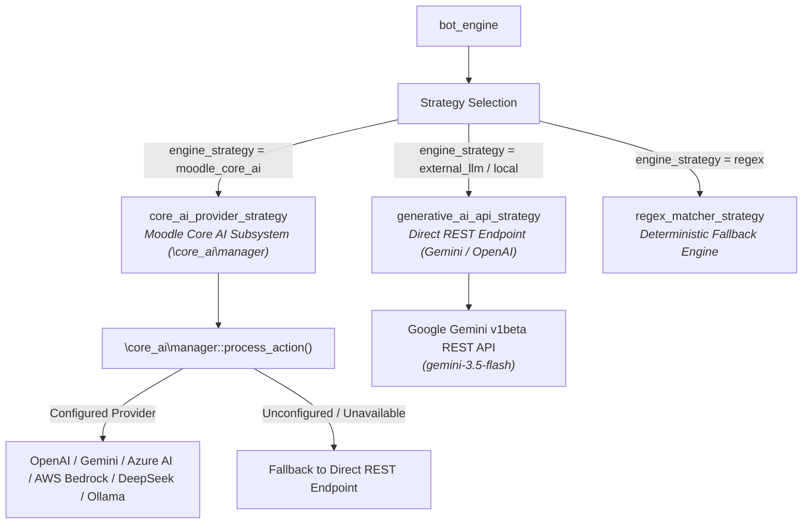

# AACURA AI Strategy & Architecture Specification

This document details the multi-tiered **AI Strategy Engine** in **AACURA** (AAC Understanding & Reflective Assistant), covering strategy selection, Moodle Core AI Subsystem integration, Google Gemini REST compliance, evaluation pipelines, and fallback mechanisms.

---

## 1. Overview of Strategy Architecture

AACURA decoupled prompt orchestration and response generation from database state storage using the Strategy Design Pattern. The strategy layer allows instructors and administrators to switch AI execution backends dynamically without changing scenario definitions or student turn data.

---

## 2. Pluggable Response Strategies

### A. Moodle Core AI Subsystem Strategy (`moodle_core_ai`)
- **Class**: `\local_aacura_core\strategy\core_ai_provider_strategy`
- **Purpose**: Leverages Moodle's native **Core AI Subsystem (`\core_ai\manager`)** introduced in recent Moodle LMS versions.
- **Benefits**:
  - Centralizes API key management under **Site Administration > General > AI > AI Providers** (`/admin/settings.php?section=aisettings`).
  - Supports multi-provider dispatching (`aiprovider_gemini`, `aiprovider_openai`, `aiprovider_azureai`, `aiprovider_awsbedrock`, `aiprovider_deepseek`, `aiprovider_ollama`).
  - Uses `\core_ai\action\generate_text` actions with contextual logging.

### B. Direct Generative AI REST Strategy (`external_llm` / `local`)
- **Class**: `\local_aacura_core\strategy\generative_ai_api_strategy`
- **Purpose**: Directly connects to OpenAI-compatible REST endpoints, specifically optimized for **Google Gemini 3.5 Flash** (`https://generativelanguage.googleapis.com/v1beta/openai`).
- **Features**:
  - Strict payload sanitization (omits zero-value `frequency_penalty` and `presence_penalty` parameters for Gemini REST compliance).
  - Dynamic parent backstory injection, pronoun enforcing, and emotional roleplay constraint system prompts.

### C. Deterministic Regex Matcher Strategy (`regex`)
- **Class**: `\local_aacura_core\strategy\regex_matcher_strategy`
- **Purpose**: Fully offline, deterministic pattern-matching engine for local development, unit testing, or zero-connectivity environments.

---

## 3. Dynamic Evaluation & Rubric Feedback Pipeline

When a simulation session reaches its conclusion (Turn 10 or terminal `RESOLUTION` / `FAIL_STATE`), AACURA initiates an automated LLM evaluation pipeline:

1. **Teacher Reply Extraction**: Collects student (teacher) turns across the session history.
2. **LAFF Don't Cry Rubric Evaluation**: Evaluates turns against the 4 LAFF steps:
   - **Listen, empathize, and communicate respect**
   - **Ask questions and ask permission to take notes**
   - **Focus on the issue**
   - **Find a first step**
3. **HTML Output Formatting**: Instructs the LLM to return clean, raw, rendered HTML markup (`<h3>`, `<h4>`, `<strong>`, `<ul>`, `<li>`, `
`).
4. **Gradebook Sync**: Calculates the final score out of 10 points and triggers Moodle Gradebook sync (`geniai_grade_item_update`).

---

## 4. Configuration & Setup Summary

Administrators can configure the AI Strategy in **Site Administration > Plugins > Local plugins > AACURA Settings** (`/admin/settings.php?section=local_aacura_coresetting`):

- **Engine Strategy**: `moodle_core_ai` | `external_llm` | `local` | `regex`
- **API Base URL**: `https://generativelanguage.googleapis.com/v1beta/openai`
- **Model Identifier**: `gemini-3.5-flash`
- **API Bearer Token**: Google Gemini or OpenAI API Key
