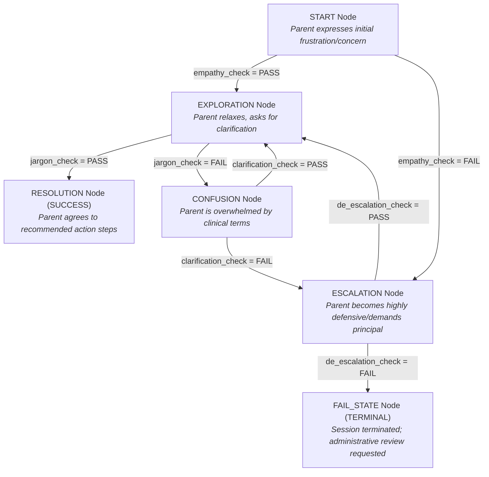

# LAFF Don't Cry Framework, Validation Checks & Dialogue Routing Guide

This document details the pedagogical foundation of EDURA: the **LAFF Don't Cry** communication framework, the automated LLM/Deterministic validation checks, and the underlying state machine transition graph.

---

## 1. Overview of the LAFF Don't Cry Framework

The **LAFF Don't Cry** strategy is an evidence-based communication framework designed for educators, Speech-Language Pathologists (SLPs), and specialists when communicating with parents of children who use Augmentative and Alternative Communication (AAC).

### The **LAFF** Principles (What Students SHOULD Do)
* **L — Listen, Empathize & Validate**: Actively listen without interrupting. Acknowledge parent frustration and validate their emotional experience before jumping into clinical solutions.
* **A — Ask Open-Ended Questions**: Ask open, supportive questions to understand the parent's home routines, challenges, and concerns rather than asking yes/no questions.
* **F — Focus on the Issues**: Keep conversations centered on practical, functional communication goals rather than abstract clinical metrics.
* **F — Find First Steps**: Partner with the parent to establish small, manageable action steps that fit naturally into daily home life.

### The **Don't Cry** Rules (What Students SHOULD NOT Do)
* **C — Criticize / Compare**: Never criticize past parent efforts or compare the child's progress to other children.
* **R — React / Escalation**: Avoid getting defensive when parents express anger, guilt, or anxiety regarding diagnosis or device choices.
* **Y — Yack / Clinical Jargon**: Avoid using dense clinical acronyms or unexplained jargon (e.g., *SGD*, *gaze-select*, *modalities*, *modeling ratio*) without clear, accessible explanation.

---

## 2. Dynamic Validation Checks

During each dialogue turn, EDURA evaluates student text input against the state's configured `validation_type`. The table below outlines the 4 validation checks implemented across scenario states:

| Validation Check Key | Framework Mapping | Purpose & Evaluation Rule | Target Outcome |
| :--- | :--- | :--- | :--- |
| `empathy_check` | **L (Listen & Empathize)** | Evaluates if the student explicitly validates parent feelings and demonstrates active empathy before offering advice. | **PASS**: Routes forward to `EXPLORATION`.<br>**FAIL**: Escalates to `ESCALATION`. |
| `jargon_check` | **Y (Don't Yack Jargon)** | Checks if the student refrains from using unexplained clinical acronyms (e.g., SGD, AT, SLP, IEP) or clearly explains them in plain language. | **PASS**: Routes forward to `RESOLUTION`.<br>**FAIL**: Routes to `CONFUSION`. |
| `de_escalation_check` | **R (Don't React)** | Checks if the student remains calm, non-defensive, and supportive when faced with emotional escalation or complaints. | **PASS**: Routes back to `EXPLORATION`.<br>**FAIL**: Routes to terminal `FAIL_STATE`. |
| `clarification_check` | **A & F (Ask & Focus)** | Evaluates if the student clarifies jargon upon parent confusion and refocuses on functional home goals. | **PASS**: Routes back to `EXPLORATION`.<br>**FAIL**: Escalates to `ESCALATION`. |

---

## 3. Dialogue State Machine & Routing Graph

EDURA models parent dialogue scenarios as directed graphs. Students navigate through dialogue nodes based on the outcome of validation checks at each turn.



---

## 4. Node & Route Definitions Table

| Node State Key | Description | Input Validation Type | Pass Route (`pass_route`) | Fail Route (`fail_route`) |
| :--- | :--- | :--- | :--- | :--- |
| **`START`** | Opening conversation state. Parent presents initial emotional barrier or complaint. | `empathy_check` | `EXPLORATION` | `ESCALATION` |
| **`EXPLORATION`** | Parent opens up to options. Student explains strategy and communication goal. | `jargon_check` | `RESOLUTION` | `CONFUSION` |
| **`CONFUSION`** | Parent expresses confusion over clinical terms or technological jargon. | `clarification_check` | `EXPLORATION` | `ESCALATION` |
| **`ESCALATION`** | Parent becomes defensive or emotionally escalated. | `de_escalation_check` | `EXPLORATION` | `FAIL_STATE` |
| **`RESOLUTION`** | **Success State (Terminal)**. Parent agrees to first steps. | *None (Terminal)* | *End of Dialogue* | *End of Dialogue* |
| **`FAIL_STATE`** | **Failure State (Terminal)**. Unmanaged escalation terminates session. | *None (Terminal)* | *End of Dialogue* | *End of Dialogue* |

---

## 5. JSON Schema Routing Example

Below is the state routing configuration from `local/geniai/examples/scenario_anna.json` demonstrating how `validation_type`, `pass_route`, and `fail_route` are wired:

```json
"states": {
  "START": {
    "bot_prompt": "I don't understand why we are changing the communication system again. Every time he gets used to something, you switch it!",
    "expected_criteria": {
      "validation_type": "empathy_check",
      "pass_route": "EXPLORATION",
      "fail_route": "ESCALATION"
    }
  },
  "EXPLORATION": {
    "bot_prompt": "Well, yes, I suppose it's frustrating for him too. What makes this new approach so much better?",
    "expected_criteria": {
      "validation_type": "jargon_check",
      "pass_route": "RESOLUTION",
      "fail_route": "CONFUSION"
    }
  }
}
```
