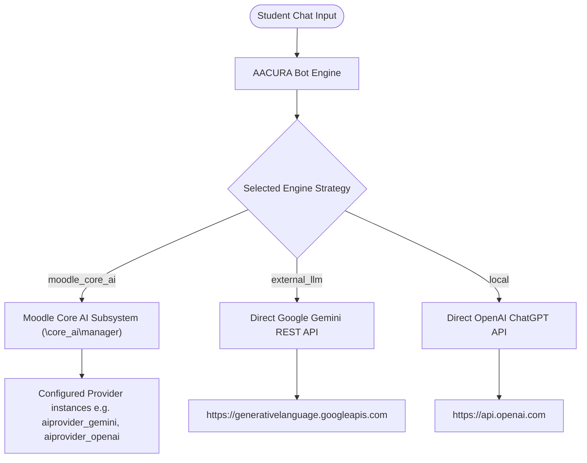

# AACURA Chatbot - Moodle Site Administrator Setup Guide

This guide provides step-by-step instructions for Moodle site administrators to create and configure an AI provider and set up the **AACURA** (AAC Understanding & Reflective Assistant) dialogue engine.

---

## 🏗️ AI Integration Options Overview

AACURA can process chatbot responses and student rubric evaluations through three different strategy backends:



1. **Moodle Core AI Subsystem (`moodle_core_ai`)**: 
   *(Recommended for Moodle 4.5+)* Centralizes AI provider API credentials and rate limits under Moodle's native AI subsystem.
2. **Google Gemini Direct REST API (`external_llm`)**:
   Connects directly to Google's Gemini models using a standard Google AI Studio API key, bypassing Moodle's core AI subsystem.
3. **ChatGPT (OpenAI Direct API) (`local`)**:
   Connects directly to OpenAI's ChatGPT models using an OpenAI API key.

---

## 🔌 Part 1: Configuring Moodle Core AI Providers (Moodle 4.5+)

If you choose the **Moodle Core AI** strategy, you must first define and enable an AI provider instance inside Moodle's global settings:

### Step 1: Access AI Provider Settings
1. Log in to your Moodle site as an **Administrator**.
2. Navigate to **Site administration > General > AI providers**.

### Step 2: Create a New Provider Instance
1. Click the **Create a new provider instance** button.
2. Select the appropriate provider plugin:
   - **Google Gemini Provider** (`aiprovider_gemini`) - for Gemini model integration.
   - **OpenAI Provider** (`aiprovider_openai`) - for ChatGPT model integration.
3. Fill in the required credentials:
   - **API Key**: Input your API key (obtained from Google AI Studio or OpenAI Platform).
   - **Endpoint / Base URL** (if prompted/customizable): Keep default unless utilizing a proxy or enterprise gateway.
4. Click **Save changes**.

### Step 3: Configure Provider Action Settings
1. On the **AI providers** overview page, ensure the status toggle for your new provider instance is set to **Enabled**.
2. Click the **settings** link next to the provider instance.
3. Locate the **Generate text** action (`\core_ai\action\generate_text`).
4. Ensure the **Generate text** action is **Enabled** (this is the specific API action AACURA uses to generate persona responses and evaluate criteria).
5. Specify the default model to use for text generation (e.g., `gemini-1.5-flash` or `gpt-4o-mini`).
6. Configure site-wide or user-specific rate limits if necessary to prevent budget overruns.

---

## ⚙️ Part 2: Configuring AACURA Plugin Settings

Once your AI provider (or direct REST credentials) is ready, you must configure the AACURA plugin settings page:

### Step 1: Access AACURA Settings
1. Navigate to **Site administration > Plugins > Local plugins > AACURA Settings** (or go to URL `/admin/settings.php?section=local_aacuracoresetting`).

### Step 2: Configure Global & Strategy Settings
Configure the settings described below:

| Field Name | Setting Key | Description / Value |
| :--- | :--- | :--- |
| **Mode** | `local_aacuracore/mode` | Set to **GeniaI** (`geniai`) to enable the AI dialogue engine. (Set to `none` to disable, or `assistant` for helper modes). |
| **Engine Strategy** | `local_aacuracore/engine_strategy` | Select the active strategy:<br>• `moodle_core_ai` — Uses Moodle's native AI providers.<br>• `external_llm` — Uses Direct Google Gemini REST API.<br>• `local` — Uses Direct OpenAI ChatGPT API. |
| **Active Scenarios** | `local_aacuracore/active_scenarios` | Select which student simulation personas are active (e.g. *Anna Charles*, *Brianna Mitchell*, *Cathy Fratner*, *Mary*). |

---

### Step 3: Configure Strategy-Specific Fields
The settings page will show interactive cards that expand/collapse based on your selected strategy:

#### Option A: If "Moodle Core AI" Strategy is Selected
- **Selected Core AI Provider** (`local_aacuracore/core_ai_selected_provider`): Select the Moodle-configured provider to dispatch prompts to (e.g., `aiprovider_gemini` or `aiprovider_openai`).

#### Option B: If "Google Gemini Direct REST API" Strategy is Selected
- **API Base URL** (`local_aacuracore/api_base_url`): Set to `https://generativelanguage.googleapis.com/v1beta/openai` (the OpenAI-compatible base URL for Gemini models).
- **API Bearer Token** (`local_aacuracore/api_bearer_token`): Input your Gemini API key (e.g. starting with `AIzaSy...`).
- **Model Identifier** (`local_aacuracore/model_identifier`): Input the model name, typically `gemini-3.5-flash`.

#### Option C: If "ChatGPT (OpenAI Direct API)" Strategy is Selected
- **API Key** (`local_aacuracore/apikey`): Input your OpenAI API key (e.g., starting with `sk-...`).
- **Model** (`local_aacuracore/model`): Select `gpt-4o-mini` (recommended for cost-efficiency) or other models like `gpt-4` or `gpt-4-turbo`.
- **Voice** (`local_aacuracore/voice`): Choose the default Voice for Text-To-Speech features (e.g., *Alloy*, *Echo*, *Fable*, *Onyx*, *Nova*, *Shimmer*).
- **Case Use** (`local_aacuracore/case`): Choose the temperature profile (e.g. **Chatbot** for low temperature / deterministic responses, or **Balanced** for slightly creative interactions).

---

### Step 4: Set General Parameters
1. **Max Tokens** (`local_aacuracore/max_tokens`): Set the output length limit. The default is `200` tokens, which is sufficient for 2-4 sentences from the parent persona.
2. **Frequency/Presence Penalties**: Keep at `0.0` unless you need to adjust dialogue repetition. Note that direct Gemini REST calls auto-sanitize zero-values to avoid model errors.
3. **Moodle Modules Integration**: Select which Moodle activity modules (e.g., glossary, quiz, wiki) the core plugin will integrate with.

Click **Save changes** at the bottom of the page to apply the configurations.

---

## 🧪 Part 3: Verification & Troubleshooting

After configuring the settings, follow these steps to verify that the connections work:

### 1. Run Setup Diagnostics (CLI)
For command-line diagnostics and configuration status logs:
```bash
php local/aacuracore/cli/aacuradebug_scenario.php --check-configs
```
This utility tests the API credentials, checks the availability of your active strategy engine, and reports error details.

### 2. Run Scenario Graph crawler tests
Ensure the scenario transition flows are healthy:
```bash
php local/aacuracore/cli/aacuradebug_scenario.php --phpunit
```
This runs the phpunit unit tests for all scenario transitions (e.g., validating the class `local_aacuracore\scenarios_test`).

### 3. Enable Developer Debugging
If responses are failing to generate:
1. Turn on Moodle's developer logs via CLI:
   ```bash
   php local/aacuracore/cli/aacuradebug_scenario.php --enable-debug
   ```
   (Alternatively, go to **Site administration > Development > Debugging**, set **Debug messages** to **DEVELOPER**, and enable **Show debug information**).
2. Check Moodle logs (`/var/log/nginx/error.log` or similar) or test chat responses directly in the UI to see detailed exception messages.
3. Once completed, turn off debugging:
   ```bash
   php local/aacuracore/cli/aacuradebug_scenario.php --disable-debug
   ```
